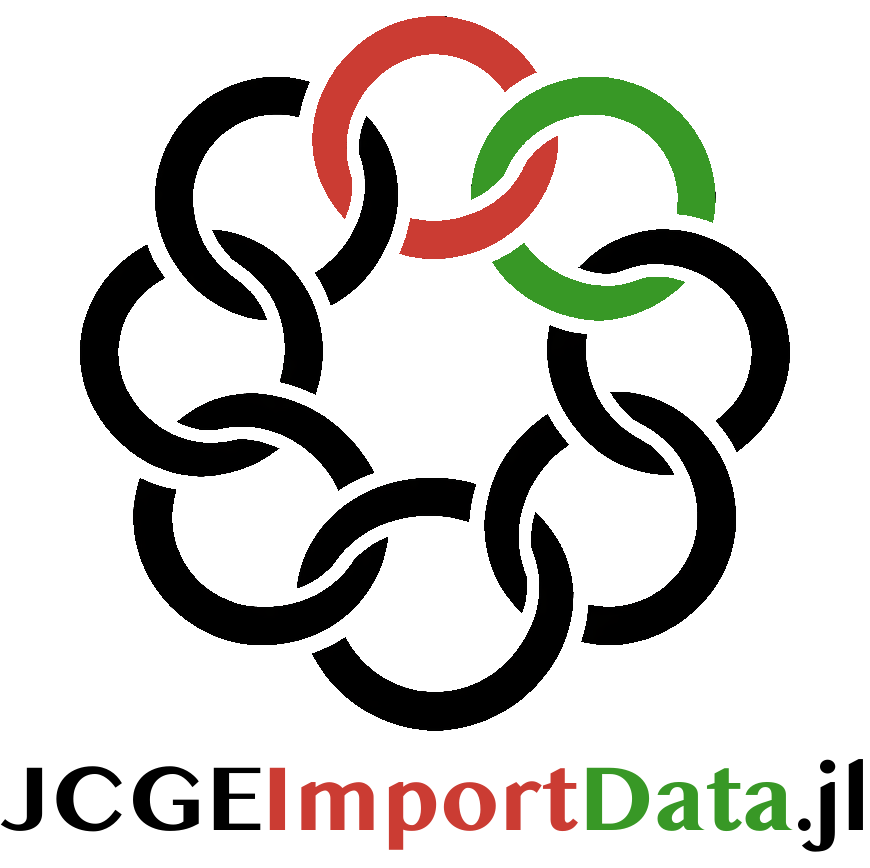

# JCGEImportData

```@raw html
<picture>
  <source srcset="assets/jcge_importdata_logo_dark.png" media="(prefers-color-scheme: dark)">
  
</picture>
```

`JCGEImportData` is part of the [JCGE](https://jcge.org) ecosystem. It imports
external economic accounts into normalized supply-use, IO, and SAM inputs while
leaving model-specific aggregation, calibration, and closure choices to the
model project.

The package provides import paths for FIGARO through
[Eurostat's official dissemination API](https://ec.europa.eu/eurostat/web/esa-supply-use-input-tables/information-data#figaro),
local BEA Make/Use exports, direct industry-by-industry IO tables, cached OECD
ICIO archives with optional local IO normalization, cached Eurostat national
SUT extracts, cached Eurostat national-accounts and satellite tables, and
cached BEA Make/Use and national-accounts tables. Downloaded source data are
verified and cached locally before use. See the Usage page for each input
contract and its scope.

## Scope boundary

JCGEImportData provides source import, normalization, validation, and selected
SUT-to-IO transformations to support CGE calibration. It does not prescribe a
complete pipeline from source tables to a Social Accounting Matrix. Sector and
regional aggregation, treatment of trade and institutions, balancing choices,
and SAM closure remain model-specific decisions.
